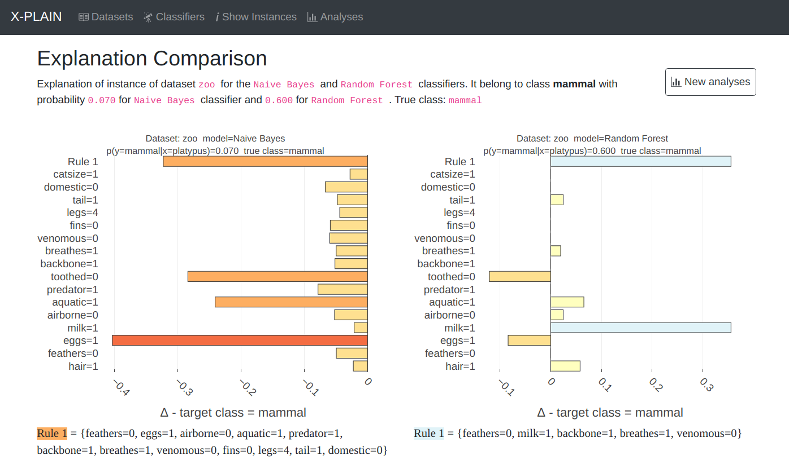

# X-PLAIN Demo
X-PLAIN is an interactive tool that allows human-in-the-loop inspection of the decision-making process of machine
learning models.

* Read the **[full paper](https://dl.acm.org/doi/pdf/10.1145/3318464.3384710)**.
* Watch the **[demonstration video](http://bit.ly/X-PLAIN-Demo-SIGMOD2020)**.

**[Bring Your Own Data to X-PLAIN.](https://dl.acm.org/doi/pdf/10.1145/3318464.3384710)**
Pastor, Eliana, and Elena Baralis. 
*Proceedings of the 2020 ACM SIGMOD International Conference on Management of Data. 2020.*



## Installation

```shell
# Create a virtualenv folder
mkdir -p ~/venv-environments/lace

# Create a new virtualenv in that folder
python3 -m venv ~/venv-environments/lace

# Activate the virtualenv
source ~/venv-environments/lace/bin/activate

# Install deps
pip install flask numpy pandas scipy snapshottest scikit-learn matplotlib seaborn 
pip install --no-binary orange3 orange3==3.15.0
```

## Running the demo

### Running the backend
```shell
FLASK_ENV=development flask run
```

### Running the frontend
```shell
cd demo_frontend/my-app
npm install # Only needed on the first run
npm start
```
Visit `localhost:3000` in a browser.

## Contributors

[Eliana Pastor][eliana], [Elena Baralis][baralis] and [Andrea Congolato][cognolato] (interface design).

## Citation
```
@inproceedings{pastor2020xplain,
author = {Pastor, Eliana and Baralis, Elena},
title = {Bring Your Own Data to X-PLAIN},
year = {2020},
isbn = {9781450367356},
publisher = {Association for Computing Machinery},
address = {New York, NY, USA},
url = {https://doi.org/10.1145/3318464.3384710},
doi = {10.1145/3318464.3384710},
booktitle = {Proceedings of the 2020 ACM SIGMOD International Conference on Management of Data},
pages = {2805–2808},
numpages = {4},
keywords = {interpretability, prediction explanation, local rules},
location = {Portland, OR, USA},
series = {SIGMOD ’20}
}
```

[eliana]: https://smartdata.polito.it/members/eliana-pastor/ "Eliana Pastor"
[baralis]: https://dbdmg.polito.it/wordpress/people/elena-baralis/ "Elena Baralis"
[cognolato]: https://mrandri19.github.io/ "Andrea Cognolato"
